# 🚀 Riff-Raff: The Guardian's Deployment Platform

[](https://scala-lang.org/)
[](https://www.playframework.com/)
[](https://aws.amazon.com/)
[](LICENSE)

> *"Deploy the transit beam"* – The Guardian's sophisticated, full-stack AWS deployment orchestrator that automates deployments through a centralized web application with comprehensive integration points for CI/CD pipelines.

## 🌐 **Riff-Raff Dashboard**

👉 **Access the live Riff-Raff dashboard here:**

# [https://riffraff.gutools.co.uk/](https://riffraff.gutools.co.uk/)

> This is the central web interface for monitoring, triggering, and auditing all deployments managed by Riff-Raff at The Guardian. Bookmark it for quick access!

## 📋 Table of Contents

### 🎯 **Project Overview**
- [🎯 About Riff-Raff](#-about-riff-raff)
- [🏗️ System Architecture](#️-system-architecture)
- [📦 Project Structure](#-project-structure)
- [🔧 Requirements & Setup](#-requirements--setup)
- [🚀 How Riff-Raff Works](#-how-riff-raff-works)

### 🔥 **Magenta Deployment Engine - Deep Dive**
- [🏗️ Core Architecture](#️-core-architecture)
  - [📋 Core Components](#-core-components)
  - [🔄 Task Execution Flow](#-task-execution-flow)
- [📦 Deployment Types Reference](#-deployment-types-reference)
  - [🔄 AutoScaling Deployments](#-autoscaling-deployments)
  - [⚡ AWS Lambda Functions](#-aws-lambda-functions)
  - [📚 AWS Lambda Layers](#-aws-lambda-layers)
  - [☁️ CloudFormation Stacks](#️-cloudformation-stacks)
  - [🖼️ AMI CloudFormation Parameters](#️-ami-cloudformation-parameters)
  - [📁 AWS S3 Uploads](#-aws-s3-uploads)
  - [🌐 Google Cloud Storage](#-google-cloud-storage)
  - [⚡ Fastly CDN](#-fastly-cdn)
  - [🔧 Fastly Compute@Edge](#-fastly-computeedge)
  - [🔄 Self-Deploy](#-self-deploy)
- [⚙️ Parameter System](#️-parameter-system)
  - [🔧 Parameter Types](#-parameter-types)
  - [✅ Validation & Defaults](#-validation--defaults)
- [🔐 Security & Credentials](#-security--credentials)
  - [🔑 KeyRing System](#-keyring-system)
  - [🎭 AWS STS Integration](#-aws-sts-integration)
- [📊 Reporting & Logging](#-reporting--logging)
  - [📝 Message Types](#-message-types)
  - [📈 Structured Logging](#-structured-logging)
- [☁️ AWS Integration](#️-aws-integration)
  - [🔌 Service Clients](#-service-clients)
  - [🔄 Retry Logic](#-retry-logic)
  - [🌍 Multi-Region Support](#-multi-region-support)

### 🌐 **Riff-Raff Web Application - Complete Technical Reference**
- [🏗️ Architecture Overview](#️-architecture-overview-1)
- [🚀 Core Features](#-core-features-1)
- [⚙️ Technology Stack](#️-technology-stack-1)
- [🧩 Application Components](#-application-components)
  - [🎮 Controllers Layer](#-controllers-layer)
  - [🚀 Deployment Engine](#-deployment-engine)
  - [🔧 Application Bootstrap](#-application-bootstrap)
- [🖥️ Web Interface](#️-web-interface)
  - [📊 Dashboard Features](#-dashboard-features)
  - [🎨 User Interface Components](#-user-interface-components)
- [🔐 Authentication & Security](#-authentication--security)
  - [🔑 Google OAuth Integration](#-google-oauth-integration)
  - [👥 Access Control](#-access-control)
  - [🚫 Deployment Restrictions](#-deployment-restrictions)
- [📦 Deployment Management](#-deployment-management-1)
  - [🎭 Deployment Orchestration](#-deployment-orchestration)
  - [📈 Progress Tracking](#-progress-tracking)
  - [🎯 Deployment Strategies](#-deployment-strategies)
- [📢 Notification System](#-notification-system)
  - [🔗 Webhook Integration](#-webhook-integration)
  - [📊 Grafana Integration](#-grafana-integration)
  - [⚠️ Failure Notifications](#️-failure-notifications)
- [⏰ Scheduling System](#-scheduling-system)
  - [⚙️ Quartz Integration](#️-quartz-integration)
  - [📅 Scheduled Jobs](#-scheduled-jobs)
- [💾 Data Persistence](#-data-persistence)
  - [🐘 PostgreSQL Integration](#-postgresql-integration)
  - [🗄️ DynamoDB Configuration](#️-dynamodb-configuration)
  - [📦 S3 Artifact Management](#-s3-artifact-management)
- [🔍 Resource Discovery](#-resource-discovery)
  - [🔍 Prism Integration](#-prism-integration)
  - [🏷️ Tagging Strategy](#️-tagging-strategy)
- [🔌 API Endpoints](#-api-endpoints)
  - [🌐 REST API Reference](#-rest-api-reference)
  - [🔌 WebSocket Endpoints](#-websocket-endpoints)
- [⚙️ Configuration](#️-configuration)
  - [📝 Application Configuration](#-application-configuration)
  - [🚀 Deployment Configuration](#-deployment-configuration)
  - [🔐 Security Configuration](#-security-configuration)
- [🧪 Testing](#-testing)
  - [📁 Test Structure](#-test-structure)
  - [🧪 Test Categories](#-test-categories)
- [🚀 Deployment](#-deployment)
  - [🔨 Build Process](#-build-process)
  - [🏗️ Infrastructure Setup](#️-infrastructure-setup)
  - [🔄 Self-Deployment](#-self-deployment)
- [🎯 Key Benefits](#-key-benefits)

### 🏗️ **Project Build System - Complete Technical Reference**
- [📋 Build System Overview](#-build-system-overview)
- [📁 Project Structure](#-project-structure-1)
  - [🗂️ Key Files](#️-key-files)
  - [📊 File Relationships](#-file-relationships)
- [📚 Dependency Management](#-dependency-management)
  - [☁️ AWS SDK Integration](#️-aws-sdk-integration)
  - [🌐 External Service Integration](#-external-service-integration)
  - [🎭 Play Framework Stack](#-play-framework-stack)
  - [🔐 Authentication & Security Libraries](#-authentication--security-libraries)
  - [🎨 Frontend & UI Components](#-frontend--ui-components)
  - [💾 Data Storage & Persistence](#-data-storage--persistence)
  - [📊 Monitoring & Logging](#-monitoring--logging)
- [🔧 Version Management Strategy](#-version-management-strategy)
  - [📈 Latest Stable Approach](#-latest-stable-approach)
  - [📌 Pinned Versions](#-pinned-versions)
  - [🎭 Play Ecosystem](#-play-ecosystem)
  - [🛡️ LTS Strategy](#️-lts-strategy)
- [🔒 Jackson Version Management](#-jackson-version-management)
  - [⚠️ Security Considerations](#️-security-considerations)
  - [🔧 Implementation Details](#-implementation-details)
- [🔌 SBT Plugins Configuration](#-sbt-plugins-configuration)
  - [🎭 Play Framework Plugin](#-play-framework-plugin)
  - [🎨 Asset Compilation Plugins](#-asset-compilation-plugins)
  - [🛠️ Development Tools](#️-development-tools)
- [⚡ CloudFormation Type Generation](#-cloudformation-type-generation)
  - [🔄 Generation Process](#-generation-process)
  - [📊 Performance Impact](#-performance-impact)
  - [🌍 Multi-Region Support](#-multi-region-support-1)
- [🛠️ Development Workflow](#️-development-workflow)
  - [💻 Common SBT Commands](#-common-sbt-commands)
  - [🔄 Development Cycle](#-development-cycle)
  - [⚡ Build Optimization Tips](#-build-optimization-tips)
- [📊 Dependency Distribution Analysis](#-dependency-distribution-analysis)
- [🔐 Security Considerations](#-security-considerations)
  - [🛡️ Vulnerability Management](#️-vulnerability-management)
  - [🚫 Exclusion Rules](#-exclusion-rules)
- [🚀 Performance Optimizations](#-performance-optimizations)
  - [⚡ Build Performance](#-build-performance)
  - [🏃 Runtime Performance](#-runtime-performance)
- [🔧 Helper Utilities](#-helper-utilities)
- [💡 Key Takeaways](#-key-takeaways)

### 🛠️ **Development & Operations**
- [🌐 Web Interface](#-web-interface)
- [⚙️ Deployment Types](#️-deployment-types)
- [🛠️ Configuration](#️-configuration)
- [🔗 CI/CD Integration](#-cicd-integration)
- [📊 Monitoring & Notifications](#-monitoring--notifications)
- [🧪 Development & Testing](#-development--testing)

### 📚 **Documentation & Resources**
- [📚 Component Documentation](#-component-documentation)
- [🎨 Screenshots](#-screenshots)
- [🤝 Contributing](#-contributing)
- [📖 Additional Resources](#-additional-resources)

## 🎯 About Riff-Raff

The Guardian's **Scala-based deployment system** designed to automate deployments by providing a web application that performs and records deployments, while offering various integration points for automating deployment pipelines.

### 💡 **What Riff-Raff Is:**
- 🎯 **Centralized deployment orchestrator** for managing deployments to AWS, Fastly, GCP, and other platforms
- 🔌 **Integrated with CI/CD systems** via comprehensive REST API
- 🛡️ **Abstraction layer** over infrastructure provisioning (CloudFormation, CDK, etc.)
- 🚪 **Deployment gatekeeper** providing safety, logging, permissions, and rollback capabilities
- 📊 **Real-time monitoring** with comprehensive deployment tracking and reporting

### ❌ **What Riff-Raff Is Not:**
- 🏗️ **Not a build server** (GitHub Actions/CI handles building)
- 🐳 **Not a container orchestrator** (no dynamic compute management)
- ⚡ **Not event-driven** (polling-based artifact discovery)

## 🏗️ System Architecture

Riff-Raff consists of three main components working together to provide a complete deployment solution:

```mermaid
graph TB
    subgraph "🌐 Riff-Raff Web Application"
        UI[Web Dashboard]
        API[REST API]
        Auth[Authentication]
        Scheduler[Job Scheduler]
    end
    
    subgraph "🧠 Magenta Deployment Engine"
        Core[Magenta Core]
        Types[Deployment Types]
        Tasks[AWS/Cloud Tasks]
        Params[Parameter System]
    end
    
    subgraph "🔧 Build System"
        SBT[SBT Configuration]
        Deps[Dependency Management]
        Plugins[Build Plugins]
        Gen[Code Generation]
    end
    
    subgraph "☁️ External Services"
        AWS[AWS Services]
        GCP[Google Cloud]
        Fastly[Fastly CDN]
        S3[S3 Artifacts]
        DB[(PostgreSQL)]
        DDB[(DynamoDB)]
    end
    
    subgraph "🔄 CI/CD Pipeline"
        GHA[GitHub Actions]
        Artifacts[Build Artifacts]
        Config[riff-raff.yaml]
    end
    
    UI --> API
    API --> Core
    Core --> Types
    Types --> Tasks
    Tasks --> AWS
    Tasks --> GCP
    Tasks --> Fastly
    
    Core --> Params
    API --> Auth
    API --> Scheduler
    
    SBT --> Deps
    SBT --> Plugins
    SBT --> Gen
    
    GHA --> Artifacts
    GHA --> Config
    Artifacts --> S3
    Config --> S3
    
    API --> DB
    API --> DDB
    Core --> S3
    
    style UI fill:#e1f5fe
    style Core fill:#f3e5f5
    style SBT fill:#fff3e0
    style AWS fill:#ff9800,color:#fff
```



### 🚨 **Good to know things**

**Remember:**
- The [Validate Template](https://riffraff.gutools.co.uk/configuration/validation) page gives fast feedback on your config.
- For more details and advanced options, see the [riff-raff.yaml reference](https://riffraff.gutools.co.uk/docs/reference/riff-raff.yaml.md).

---

## ⚠️ IMPORTANT: Manual Deployments for Membership CODE Environments

<div style="color: red; border: 2px solid red; padding: 12px; font-weight: bold; background: #fff0f0">
<strong>For <code>membership</code> projects in the <code>CODE</code> environment, deployments are <u>NOT</u> triggered automatically!</strong><br>
You must trigger these deployments manually from the Riff Raff dashboard.
This is a critical step – please ensure you always deploy CODE manually when working on membership services.
</div>

---

## Validating Your riff-raff.yaml Before Deployment

Before deploying, you can validate your `riff-raff.yaml` configuration file to check for syntax errors and configuration issues. This helps prevent failed deploys and ensures your config complies with Riff Raff requirements.

- **Validate here:** [https://riffraff.gutools.co.uk/configuration/validation](https://riffraff.gutools.co.uk/configuration/validation)

---

## Best Practices & Tips
- **Always validate your config before deploying.**
- Use the dashboard documentation menu for up-to-date guides and troubleshooting.
- Mark your most-used projects as favourites for faster access.
- Check the deployment history for warnings, failures, or unusual activity.
- For any environment with manual deploys (like `membership:CODE`), communicate with your team and document the deployment in the release notes.

---

### 🔄 **CI/CD Division of Labor**

| Stage | Responsibility | Who Does It? |
|-------|---------------|--------------|
| **🏗️ Build & Test** | Compile, test, create artifacts | GitHub Actions |
| **📦 Artifact Upload** | ZIP, riff-raff.yaml, CloudFormation to S3 | GitHub Actions |
| **🎯 Trigger Deploy** | Initiate deployment via API | actions-riff-raff |
| **🚀 Execute Deploy** | Read config, orchestrate deployment tasks | Riff-Raff + Magenta |
| **☁️ Cloud Operations** | AWS/GCP/Fastly API calls | Magenta Engine |
| **📊 Monitor & Report** | Track progress, notifications, logging | Riff-Raff Dashboard |

## 📦 Project Structure

```
riff-raff/
├── 🌐 riff-raff/              # Web Application Dashboard
│   ├── app/                   # Play Framework application
│   ├── conf/                  # Configuration files
│   ├── public/                # Static assets and documentation
│   └── test/                  # Application tests
├── 🧠 magenta-lib/            # Core Deployment Engine
│   ├── src/main/scala/        # Magenta library source
│   └── src/test/scala/        # Engine tests
├── 🔧 project/                # SBT Build System
│   ├── Dependencies.scala     # Dependency management
│   ├── plugins.sbt           # SBT plugins
│   └── build.properties      # SBT version
├── 📜 script/                 # Development scripts
└── 📋 docs/                   # Additional documentation
```

## 🔧 Requirements & Setup

### **Prerequisites**
Riff-Raff has been built with The Guardian's toolchain and works best with similar setups:

- **☁️ AWS Integration**: Artifacts and `riff-raff.yaml` files in S3 buckets with paths: `project-name/build-number`
- **🔍 Resource Discovery**: AWS SDK and [Prism](https://github.com/guardian/prism) for infrastructure discovery
- **🗄️ Data Storage**: PostgreSQL database and DynamoDB tables for configuration and history
- **🔐 Authentication**: Google OAuth with domain restrictions

### **Technology Stack**
- **Backend**: Scala 2.13 + Play Framework 3.0.6
- **Database**: PostgreSQL (primary) + DynamoDB (configuration)
- **Frontend**: Bootstrap + jQuery + D3.js
- **Cloud**: AWS SDK v2, Google Cloud, Fastly APIs
- **Build**: SBT 1.10.7 with custom plugins

## 🚀 How Riff-Raff Works

### **🔄 Deployment Workflow**

```mermaid
sequenceDiagram
    participant Dev as 👨‍💻 Developer
    participant GHA as 🔧 GitHub Actions
    participant S3 as 📦 S3 Bucket
    participant RR as 🚀 Riff-Raff
    participant Mag as 🧠 Magenta
    participant AWS as ☁️ AWS Services
    
    Dev->>GHA: Push code / Create release
    GHA->>GHA: Build & test application
    GHA->>S3: Upload artifacts + riff-raff.yaml
    GHA->>RR: Trigger deployment via API
    
    RR->>S3: Poll for new artifacts
    RR->>RR: Validate configuration
    RR->>Mag: Initialize deployment
    
    Mag->>Mag: Parse deployment types
    Mag->>Mag: Generate task graph
    Mag->>AWS: Execute deployment tasks
    
    AWS-->>Mag: Task results
    Mag-->>RR: Progress updates
    RR-->>Dev: Real-time notifications
    
    Note over RR,AWS: Supports 10+ deployment types
    Note over RR: Web dashboard + REST API
```



### **🎯 Core Capabilities**

#### **🌟 Deployment Management**
- **Interactive web dashboard** for deployment requests
- **Real-time monitoring** with live log streaming
- **Multi-stage support** (CODE, PROD, etc.)
- **Deployment strategies** (MostlyHarmless, UnstoppableTrain)
- **Rollback and recovery** procedures

#### **🔒 Security & Governance**
- **Google OAuth authentication** with domain restrictions
- **Role-based access control** (Viewer/Deployer/Admin)
- **Deployment restrictions** and approval workflows
- **Change freeze management** for maintenance windows
- **Comprehensive audit logging**

#### **⚡ Advanced Features**
- **Scheduled deployments** with Quartz scheduler
- **Webhook notifications** for external integrations
- **Configuration validation** with preview capabilities
- **Dependency management** and orchestration
- **Grafana integration** for monitoring

## 🌐 Web Interface

The Riff-Raff dashboard provides an intuitive interface for managing deployments:

### **📱 Key Features**
- **🎯 Deployment Request Form**: Interactive form with project autocomplete, build selection, and parameter customization
- **📊 Real-time Monitoring**: Live deployment progress with task-level tracking and log streaming
- **📈 History & Analytics**: Comprehensive deployment history with filtering, search, and trend analysis
- **⚙️ Configuration Management**: Validation tools and preview capabilities
- **🔔 Notification Center**: Webhook management and alert configuration

### **🎨 User Experience**
- **Responsive design** with Bootstrap 3.x
- **Real-time updates** via WebSocket connections
- **Mobile-friendly** interface
- **Accessibility** considerations
- **Modern UI patterns** with D3.js visualizations

## ⚙️ Deployment Types

Riff-Raff supports **10 deployment types** through the Magenta engine:

### **☁️ AWS Deployment Types**
1. **🔄 autoscaling** - Rolling ASG deployments with health checks
2. **⚡ aws-lambda** - Lambda function deployments with versioning
3. **📦 aws-lambda-layer** - Lambda layer management
4. **🏗️ cloud-formation** - CloudFormation stack management with change sets
5. **🖼️ ami-cloudformation-parameter** - AMI parameter updates in CF stacks
6. **📁 aws-s3** - S3 uploads with cache control and ACL management

### **🌐 Multi-Cloud Support**
7. **☁️ gcp-gcs** - Google Cloud Storage uploads
8. **🚀 fastly** - Fastly CDN VCL configuration deployment
9. **⚡ fastly-compute** - Fastly Compute@Edge packages

### **🔄 Special Types**
10. **🎯 self-deploy** - Riff-Raff self-deployment mechanism

Each deployment type includes:
- **Type-safe parameters** with validation
- **Default value handling**
- **AWS service integration**
- **Error handling and retry logic**
- **Progress reporting**

### **Magenta Library Details**

The Magenta library is the core deployment engine of Riff-Raff. It provides a flexible and extensible framework for managing deployments across multiple cloud providers.

#### **📦 Deployment Type Configuration**

Each deployment type is configured using a YAML file that defines the deployment parameters, dependencies, and actions.

```yaml
# Example deployment type configuration
deploymentTypes:
  autoscaling:
    parameters:
      - name: asgName
        type: string
        required: true
      - name: region
        type: string
        required: true
    dependencies:
      - update-database
    actions:
      - execute-deployment
```

#### **🔄 Task Execution Model**

The Magenta library uses a task execution model to manage the deployment process. Each deployment type is broken down into a series of tasks that are executed in a specific order.

```scala
// Example task execution model
trait Task {
  def execute(): Unit
}

class AutoscalingTask extends Task {
  override def execute(): Unit = {
    // Execute autoscaling deployment
  }
}

class UpdateDatabaseTask extends Task {
  override def execute(): Unit = {
    // Execute database update
  }
}
```

#### **📊 Parameter System**

The Magenta library provides a parameter system that allows users to customize the deployment process. Parameters can be defined at the deployment type level or at the task level.

```scala
// Example parameter system
trait Parameter {
  def name: String
  def value: String
}

class AutoscalingParameter extends Parameter {
  override def name: String = "asgName"
  override def value: String = "my-asg"
}
```

#### **📚 API Reference**

The Magenta library provides a comprehensive API reference that documents all the available deployment types, tasks, and parameters.

```scala
// Example API reference
trait DeploymentType {
  def name: String
  def parameters: List[Parameter]
  def dependencies: List[Task]
  def actions: List[Task]
}

class AutoscalingDeploymentType extends DeploymentType {
  override def name: String = "autoscaling"
  override def parameters: List[Parameter] = List(AutoscalingParameter())
  override def dependencies: List[Task] = List(UpdateDatabaseTask())
  override def actions: List[Task] = List(AutoscalingTask())
}
```

#### **🔒 Security**

The Magenta library provides a robust security model that ensures secure deployment operations.

```scala
// Example security model
trait SecurityContext {
  def authenticate(): Unit
  def authorize(): Unit
}

class AWS SecurityContext extends SecurityContext {
  override def authenticate(): Unit = {
    // Authenticate with AWS credentials
  }

  override def authorize(): Unit = {
    // Authorize deployment actions
  }
}
```

#### **📊 Deployment Types**

The Magenta library supports the following deployment types:

*   **Autoscaling**: Rolling ASG deployments with health checks
*   **AWS Lambda**: Lambda function deployments with versioning
*   **AWS Lambda Layer**: Lambda layer management
*   **CloudFormation**: CloudFormation stack management with change sets
*   **AMI CloudFormation Parameter**: AMI parameter updates in CF stacks
*   **AWS S3**: S3 uploads with cache control and ACL management
*   **Google Cloud Storage**: Google Cloud Storage uploads
*   **Fastly**: Fastly CDN VCL configuration deployment
*   **Fastly Compute**: Fastly Compute@Edge packages
*   **Self-Deploy**: Riff-Raff self-deployment mechanism

Each deployment type is implemented as a separate class that extends the `DeploymentType` trait.

```scala
// Example deployment type implementation
class AutoscalingDeploymentType extends DeploymentType {
  override def name: String = "autoscaling"

  override def parameters: List[Parameter] = List(
    AutoscalingParameter("asgName", "my-asg"),
    AutoscalingParameter("region", "eu-west-1")
  )

  override def dependencies: List[Task] = List(
    UpdateDatabaseTask()
  )

  override def actions: List[Task] = List(
    AutoscalingTask()
  )
}
```

## 🛠️ Configuration

### **📋 riff-raff.yaml Structure**

The `riff-raff.yaml` file is the heart of deployment configuration:

```yaml
# Basic project configuration
regions: [eu-west-1, us-east-1]
stacks: [deploy, content]
allowedStages: [CODE, PROD]

# Deployment definitions
deployments:
  my-app:
    type: autoscaling
    parameters:
      bucket: my-deployment-bucket
    dependencies: [update-database]
    
  update-database:
    type: cloud-formation
    parameters:
      templatePath: infrastructure.json
      cloudFormationStackName: my-app-db
```

### **🔧 Key Configuration Sections**

#### **🎯 Top-Level Keys**
- `regions`: AWS regions for deployment
- `stacks`: Logical application stacks
- `allowedStages`: Permitted deployment stages
- `deployments`: Deployment definitions

#### **📦 Deployment Parameters**
- `type`: Deployment type (autoscaling, aws-lambda, etc.)
- `parameters`: Type-specific configuration
- `dependencies`: Deployment ordering
- `actions`: Custom deployment actions

### **✅ Configuration Validation**
- **Built-in validation** in Riff-Raff dashboard
- **Preview capabilities** before deployment
- **Parameter type checking**
- **Dependency validation**

## 🔗 CI/CD Integration

### **🔧 GitHub Actions Integration**

```yaml
# Example GitHub Actions workflow
name: Deploy to Production
on:
  release:
    types: [published]

jobs:
  deploy:
    runs-on: ubuntu-latest
    steps:
      - uses: actions/checkout@v3
      - name: Build application
        run: |
          # Build and test your application
          npm run build
          npm test
      
      - name: Deploy with Riff-Raff
        uses: guardian/actions-riff-raff@v2
        with:
          projectName: my-project
          buildNumber: ${{ github.run_number }}
          stage: PROD
          contentDirectories: |
            my-app:
              - dist/
```

### **📦 Artifact Management**
- **S3-based storage** with versioned artifacts
- **Metadata tagging** for build tracking
- **Automatic cleanup** and lifecycle management
- **Access control** and security

### **🔄 Deployment Triggers**
- **API-based triggering** from CI systems
- **Scheduled deployments** for regular releases
- **Manual deployments** via web dashboard
- **Dependency-based orchestration**

## 📊 Monitoring & Notifications

### **🔔 Notification System**
- **Webhook integration** for external systems
- **Email notifications** for deployment events
- **Slack integration** (configurable)
- **Grafana annotations** for deployment correlation

### **📈 Monitoring & Analytics**
- **Real-time deployment tracking**
- **Performance metrics** collection
- **Success/failure analytics**
- **Historical trend analysis**
- **Resource utilization** monitoring

### **🚨 Alerting**
- **Deployment failure** notifications
- **Performance degradation** alerts
- **Security event** monitoring
- **Custom alert handlers**

## 🧪 Development & Testing

### **🔬 Testing Strategy**
- **Unit tests** for core components
- **Integration tests** for deployment workflows
- **Database tests** for persistence layer
- **API tests** for external interfaces

### **🛠️ Development Workflow**
- **SBT-based build** system
- **Hot reloading** in development
- **Automated code formatting** with Scalafmt
- **Code quality tools** with Scalafix

### **🚀 Local Development**
```bash
# Start development environment
./script/start

# Run tests
./script/test

# Build distribution
sbt dist
```

## 📚 Component Documentation

Detailed documentation is available for each major component:

### **🧠 [Magenta Deployment Engine](magenta-lib/README.md)**
- Core deployment engine architecture
- All 10 deployment types with examples
- Parameter system and validation
- Task execution model
- AWS integration patterns
- Security and credential management

### **🌐 [Riff-Raff Web Application](riff-raff/README.md)**
- Play Framework application architecture
- Web dashboard features and UI components
- Authentication and security model
- API endpoints and integration
- Database schema and persistence
- Real-time monitoring and notifications

### **🔧 [Build System & Dependencies](project/README.md)**
- SBT build configuration
- Dependency management strategy
- Plugin ecosystem
- Code generation utilities
- Development workflow
- Performance optimizations

### **📖 [Application Documentation](riff-raff/public/docs)**
- User guides and tutorials
- API reference documentation
- Configuration examples
- Troubleshooting guides

## 🎨 Screenshots

Here are some screenshots showing Riff-Raff in action:

### **📊 Deployment History**

*The deployment history view showing all deployments with filtering capabilities (filtered on PROD and projects containing 'mobile')*

### **📋 Deployment Details**

*Individual deployment view displaying overall results and executed task list with detailed logging*

### **🚀 Deployment Request**

*Simple deployment request form with project selection, build options, and preview capabilities*

### **🔄 Continuous Deployment**

*Continuous deployment configuration showing automated deployment triggers for newly completed builds*

## 🤝 Contributing

We welcome contributions to Riff-Raff! Please see our [Contributing Guide](CONTRIBUTING.md) for details on:

- **Code style** and formatting standards
- **Testing requirements** and best practices
- **Pull request process** and review guidelines
- **Issue reporting** and feature requests
- **Development environment** setup

### **🔧 Development Setup**
1. **Clone the repository**
2. **Install dependencies**: SBT, PostgreSQL, AWS CLI
3. **Configure authentication**: Google OAuth credentials
4. **Start development server**: `./script/start`
5. **Run tests**: `./script/test`

## 📖 Additional Resources

### **🔗 Related Projects**
- **[Prism](https://github.com/guardian/prism)** - AWS resource discovery service
- **[actions-riff-raff](https://github.com/guardian/actions-riff-raff)** - GitHub Actions integration
- **[riffraff-platform](https://github.com/guardian/riffraff-platform)** - Infrastructure as Code

### **📚 Documentation**
- **[AWS Integration Guide](docs/aws-integration.md)** - AWS service setup and configuration
- **[Authentication Setup](docs/authentication.md)** - Google OAuth configuration
- **[Deployment Best Practices](docs/best-practices.md)** - Recommended deployment patterns
- **[Troubleshooting Guide](docs/troubleshooting.md)** - Common issues and solutions

### **🎯 What's Next?**
See the `TODO.txt` file for planned features and improvements.

---

## 🌟 Key Benefits

### 👨‍💻 For Developers
- **Intuitive web interface** for deployment management
- **Real-time feedback** on deployment progress
- **Configuration validation** before deployment
- **Comprehensive deployment history** and analytics

### 🔧 For Operations
- **Centralized deployment control** across all environments
- **Comprehensive audit trails** for compliance and security
- **Deployment restrictions** and approval workflows
- **Integration with monitoring** and alerting systems

### 🏢 For Organizations
- **Standardized deployment processes** across teams
- **Reduced deployment risks** through validation and testing
- **Improved deployment velocity** with automation
- **Better visibility** into system changes and performance

---

**Riff-Raff** represents a mature, production-ready deployment platform that combines powerful deployment orchestration with an intuitive web interface, providing The Guardian with reliable, scalable, and secure deployment capabilities across their entire infrastructure.

*Deploy the transit beam* 🚀

## 📋 Core Components

Riff-Raff is architected as a comprehensive deployment platform consisting of three integrated layers that work together to provide a complete deployment solution:

### 🚀 Magenta Deployment Engine

**Magenta** serves as the core deployment orchestration engine, designed as a plugin-based system that abstracts AWS deployment complexity while providing fine-grained control.


#### Core Architecture Components

**DeploymentPackage** - Represents a deployable artifact with metadata and configuration:
```scala
case class DeploymentPackage(
  name: String,                           // Package identifier
  pkgApp: App,                           // Application metadata
  pkgSpecificData: Map[String, JsValue], // Configuration data
  deploymentType: DeploymentType,        // Deployment strategy
  s3Package: S3Path                      // Artifact location
)
```

**DeploymentType Plugin System** - Each deployment type implements specific deployment strategies:
```scala
trait DeploymentType {
  def name: String                    // Unique identifier
  def documentation: String           // User documentation
  def params: Seq[Param[_]]          // Configuration parameters
  def actionsMap: Map[String, Action] // Available actions
  def defaultActions: List[Action]    // Default deployment actions
}
```

**Task Execution Model** - Atomic units of work that perform specific deployment operations:
```scala
trait Task {
  def execute(resources: DeploymentResources, stopFlag: => Boolean): Unit
  def keyRing: KeyRing              // Security credentials
  def description: String           // Human-readable description
  def verbose: String              // Detailed description
}
```

### 🌐 Web Application Dashboard

The **Riff-Raff Web Application** provides an intuitive web interface built on Play Framework 3.0.6, serving as the primary user interaction layer for deployment management.


#### Key Application Features

- **Interactive Web Dashboard** with real-time monitoring and live log streaming
- **Security & Governance** with Google OAuth domain restrictions and role-based access control
- **Advanced Scheduling** using Quartz-based scheduled deployments
- **Comprehensive Notifications** via webhooks and Grafana integration
- **Multi-Environment Support** with deployment restrictions and change freeze management

#### Technology Stack

| Component | Technology | Version | Purpose |
|-----------|------------|---------|---------|
| **Backend Framework** | Scala | 2.13 | Core application language |
| **Web Framework** | Play Framework | 3.0.6 | HTTP server and MVC framework |
| **Concurrency** | Akka Actors | Latest | Concurrent deployment processing |
| **Database Access** | ScalikeJDBC | 3.5.0 | SQL database connectivity |
| **Primary Database** | PostgreSQL | Latest | Deployment history and user data |
| **Configuration Store** | DynamoDB | Latest | Deployment configurations |
| **Artifact Storage** | AWS S3 | Latest | Deployment artifacts and logs |
| **Authentication** | Google OAuth 2.0 | Latest | Single sign-on with domain restrictions |
| **Frontend Framework** | Bootstrap | 3.4.1 | Responsive UI components |
| **JavaScript Libraries** | jQuery, D3.js | Latest | Interactive visualizations |

### 🏗️ Build System Architecture

The **SBT-based build system** provides sophisticated dependency management, code generation, and deployment artifact creation capabilities.


#### Build System Components

| Component | Purpose | Key Features |
|-----------|---------|--------------|
| **Dependencies.scala** | Centralized dependency management | Version consistency, security updates |
| **plugins.sbt** | SBT plugin configuration | Play Framework, asset compilation, testing |
| **GenerateCfnTypes.scala** | CloudFormation type generation | Performance optimization, type safety |
| **Helpers.scala** | Build utilities | Version sanitization, helper functions |

#### Dependency Management Strategy

The build system employs a sophisticated dependency management approach:

- **AWS SDK v2 Integration** - Complete integration with 10+ AWS services
- **Security-First Approach** - Jackson version management for vulnerability prevention
- **Performance Optimization** - CloudFormation type generation saves 7+ seconds per deployment
- **Development Efficiency** - Hot reloading, asset compilation, and testing integration

## 🔧 Deployment Types

Riff-Raff supports **10 comprehensive deployment types**, each optimized for specific AWS services and deployment patterns:

### 1. 🔄 AutoScaling Deployments
Manages Auto Scaling Group deployments with rolling updates and health checks.

```yaml
deployments:
  my-app:
    type: autoscaling
    parameters:
      bucket: my-deployment-bucket
      healthcheckGrace: 20s           # Time to wait for health checks
      warmupGrace: 1m                 # Instance warmup time
      terminationGrace: 10m           # Graceful termination time
      migrationTagRequirements: MustNotBePresent
      secondsToWait: 15m              # Maximum deployment time
      lookupByTags: true              # Tag-based ASG discovery
```

**Key Features:**
- Rolling updates with configurable batch sizes
- Health check integration with ELB/ALB
- Tag-based instance discovery
- Load balancer management
- Migration support with tag requirements

### 2. ⚡ Lambda Deployments
Deploys AWS Lambda functions with support for versioning and aliases.

```yaml
deployments:
  my-lambda:
    type: aws-lambda
    parameters:
      bucket: lambda-deployment-bucket
      functionNames:                  # Specific function names
        - MyFunction
        - AnotherFunction
      lookupByTags: true             # Tag-based function discovery
      prefixStack: true              # Include stack in function names
      fileName: lambda.zip           # Artifact filename
      publish: true                  # Publish new version
```

**Advanced Features:**
- Function code updates via S3 or direct upload
- Version management and publishing
- Alias management for blue/green deployments
- Environment variable updates
- Tag-based function discovery

### 3. 📦 Lambda Layer Deployments
Manages AWS Lambda layers for shared code and dependencies.

```yaml
deployments:
  shared-layer:
    type: aws-lambda-layer
    parameters:
      bucket: lambda-layers-bucket
      layerName: MySharedLayer       # Layer name
      fileName: layer.zip            # Layer artifact
      prefixStackToKey: true         # Include stack in S3 key
      description: "Shared utilities layer"
```

### 4. 🏗️ CloudFormation Deployments
Manages CloudFormation stacks using change sets for safe deployments.

```yaml
deployments:
  infrastructure:
    type: cloud-formation
    parameters:
      templatePath: cloudformation.yaml
      cloudFormationStackName: my-stack
      prependStackToCloudFormationStackName: false
      createStackIfAbsent: true      # Create stack if it doesn't exist
      stackTags:                     # Stack-level tags
        Environment: Production
        Team: Platform
      templateParameters:            # Template parameters
        InstanceType: t3.medium
        KeyName: my-key
      manageStackPolicy: true        # Manage stack update policies
```

### 5. 🖼️ AMI CloudFormation Parameter Updates
Specialized deployment type for updating AMI parameters in existing CloudFormation stacks.

```yaml
deployments:
  ami-update:
    type: ami-cloudformation-parameter
    parameters:
      cloudFormationStackName: my-app-stack
      amiParameterMap:
        ImageId:                     # Parameter name in CF template
          BuiltBy: amigo            # AMI tag filters
          AmigoStage: PROD
          Recipe: my-app-recipe
      amiParametersToTags:          # Map CF params to AMI tags
        ImageId: AmiId
```

### 6. 📁 AWS S3 Deployments
Uploads files to S3 buckets with advanced configuration options.

```yaml
deployments:
  static-assets:
    type: aws-s3
    parameters:
      bucket: my-static-assets
      publicReadAcl: false           # ACL configuration
      cacheControl:                  # Pattern-based cache headers
        - pattern: "^js/lib/"
          value: "max-age=315360000"
        - pattern: "^css/"
          value: "max-age=86400"
        - pattern: ".*"
          value: "max-age=3600"
      prefixStack: true              # Include stack in S3 prefix
      bucketSsmLookup: false         # Lookup bucket from SSM
```

### 7. ☁️ Google Cloud Storage Deployments
Uploads files to Google Cloud Storage buckets.

```yaml
deployments:
  gcs-assets:
    type: gcp-gcs
    parameters:
      bucket: my-gcs-bucket
      prefixStage: true              # Include stage in path
      prefixPackage: true            # Include package name
      prefixStack: true              # Include stack name
      cacheControl:                  # GCS cache control
        - pattern: "^static/"
          value: "public, max-age=31536000"
      bucketSsmLookup: true          # SSM parameter lookup
```

### 8. 🚀 Fastly CDN Deployments
Deploys VCL configuration to Fastly CDN.

```yaml
deployments:
  cdn-config:
    type: fastly
    parameters: {}  # Uses service credentials from deployment resources
```

**Fastly Deployment Workflow:**
1. Clone currently active version
2. Delete existing files from clone
3. Upload new VCL files
4. Wait for compilation
5. Validate configuration
6. Activate new version

### 9. ⚡ Fastly Compute@Edge Deployments
Deploys Compute@Edge packages to Fastly.

```yaml
deployments:
  edge-compute:
    type: fastly-compute
    parameters:
      bucket: compute-packages-bucket
      serviceId: my-service-id       # Fastly service ID
```

### 10. 🎯 Self-Deploy
Special deployment type for Riff-Raff to deploy itself.

```yaml
deployments:
  riff-raff:
    type: self-deploy
    parameters:
      bucket: riff-raff-dist
      publicReadAcl: false
```

**Self-Deploy Process:**
1. Upload new Riff-Raff artifact to S3
2. Trigger shutdown with specific exit code
3. Wait for current deployments to complete
4. Restart with new version

## 🔒 Security & Authentication

### Authentication System
- **Google OAuth 2.0** integration with domain restrictions (guardian.co.uk)
- **Session Management** with secure cookies and CSRF protection
- **Multi-Factor Authentication** support for enhanced security

### Access Control Levels
| Role | Permissions | Capabilities |
|------|-------------|--------------|
| **Viewer** | Read-only access | View deployments, history, and configurations |
| **Deployer** | Deployment execution | Trigger deployments, view logs, manage schedules |
| **Admin** | Full system access | User management, system configuration, restrictions |

### Security Features
- **Deployment Restrictions** with project-level and stage-specific blocks
- **Time-based Freezes** for maintenance windows and change control
- **Emergency Stops** for immediate deployment halting
- **Audit Trails** with comprehensive logging and tracking
- **Credential Management** via AWS Parameter Store and secret rotation

## 📊 Task Execution Flow


## 🔧 Parameter System

Riff-Raff uses a type-safe parameter system with comprehensive validation:

```scala
// Parameter definition examples
val bucketParam = Param[String](
  "bucket",
  "S3 bucket for deployment artifacts",
  optional = false
)

val healthcheckGraceParam = Param[Duration](
  "healthcheckGrace", 
  "Time to wait for health checks",
  optional = true
).default(Duration.ofSeconds(30))

val cacheControlParam = Param[List[PatternValue]](
  "cacheControl",
  "Pattern-based cache control headers"
)
```

**Parameter Features:**
- **Type Safety**: Compile-time type checking
- **Documentation**: Built-in parameter documentation
- **Defaults**: Static and context-based defaults
- **Validation**: Automatic validation and error reporting
- **Context Awareness**: Parameters can derive values from deployment context

## 🖥️ Web Interface & User Experience

### Interactive Dashboard Features

The Riff-Raff web interface provides a comprehensive deployment management experience:

#### **Deployment Forms**
- **Autocomplete Integration** with project and build discovery
- **Real-time Validation** of configuration parameters
- **Multi-Environment Selection** with stage-specific options
- **Batch Deployment Support** for multiple projects simultaneously

#### **Live Monitoring**
- **WebSocket-based Updates** for real-time deployment progress
- **Log Streaming** with filtering and search capabilities
- **Task-level Progress Tracking** with detailed status indicators
- **Stop/Cancel Capabilities** for active deployments

#### **History & Reporting**
- **Comprehensive Deployment History** with advanced filtering
- **Performance Metrics** and deployment duration analysis
- **Error Aggregation** and failure pattern analysis
- **Audit Trail** with user action tracking

### User Interface Components

| Component | Technology | Purpose |
|-----------|------------|---------|
| **Navigation** | Bootstrap 3.x | Responsive menu structure |
| **Forms** | Play Framework Templates | Type-safe form handling |
| **Charts** | D3.js + Rickshaw.js | Interactive deployment visualizations |
| **Real-time Updates** | WebSockets | Live deployment progress |
| **Asset Pipeline** | CoffeeScript + LESS | Compiled frontend assets |

## 📢 Notification & Integration System

### Webhook Integration
Configurable HTTP notifications for deployment events:

```yaml
# Webhook configuration example
webhooks:
  - url: "https://hooks.slack.com/services/YOUR/SLACK/WEBHOOK"
    method: POST
    triggers:
      - deployment.started
      - deployment.completed
      - deployment.failed
      - stage.completed
    headers:
      Content-Type: "application/json"
```

**Supported Triggers:**
- **Deployment Lifecycle**: started, completed, failed, cancelled
- **Stage Transitions**: stage started, stage completed, stage failed
- **Custom Events**: user-defined deployment milestones

### Grafana Integration
- **Deployment Annotations** on dashboards for correlation with metrics
- **Performance Impact Analysis** linking deployments to system behavior
- **Historical Markers** for deployment timeline visualization

### Notification Channels
- **Email Notifications** for deployment status updates
- **Slack Integration** with rich message formatting
- **PagerDuty Integration** for critical failure alerts
- **Custom Webhooks** for third-party system integration

## ⏰ Advanced Scheduling System

### Quartz-based Scheduling
Riff-Raff uses Quartz Scheduler for sophisticated deployment timing:

```scala
// Scheduling configuration
val scheduler = StdSchedulerFactory.getDefaultScheduler()
val jobDetail = JobBuilder.newJob(classOf[DeploymentJob])
  .withIdentity("deploy-job", "deployment-group")
  .build()

val trigger = TriggerBuilder.newTrigger()
  .withIdentity("deploy-trigger", "deployment-group")
  .withSchedule(CronScheduleBuilder.cronSchedule("0 0 2 * * ?"))
  .build()
```

### Scheduling Features
- **Cron-based Scheduling** with full cron expression support
- **Timezone Support** for global deployment coordination
- **Recurring Deployments** for regular maintenance and updates
- **Maintenance Window Scheduling** with automatic deployment queuing
- **Dynamic Schedule Updates** without system restart
- **Job Pause/Resume** capabilities for operational flexibility
- **Execution History Tracking** with success/failure analysis
- **Failure Retry Logic** with configurable backoff strategies

### Schedule Management
- **Web-based Schedule Editor** with cron expression validation
- **Schedule Conflict Detection** to prevent overlapping deployments
- **Dependency-aware Scheduling** respecting deployment prerequisites
- **Emergency Schedule Override** for urgent deployments

## 💾 Data Persistence & Storage

### PostgreSQL Integration
Primary database for deployment history and user management:

```sql
-- Core deployment tracking table
CREATE TABLE deployment (
    uuid UUID PRIMARY KEY,
    start_time TIMESTAMP NOT NULL,
    deployer VARCHAR(255) NOT NULL,
    project_name VARCHAR(255) NOT NULL,
    build VARCHAR(255) NOT NULL,
    stage VARCHAR(255) NOT NULL,
    recipe_name VARCHAR(255),
    status VARCHAR(50) NOT NULL,
    log_url TEXT,
    created_at TIMESTAMP DEFAULT CURRENT_TIMESTAMP
);

-- User authorization table
CREATE TABLE auth (
    email VARCHAR(255) PRIMARY KEY,
    first_name VARCHAR(255),
    last_name VARCHAR(255),
    last_seen TIMESTAMP,
    permissions TEXT[]
);
```

**Database Features:**
- **Play Evolutions** for automated schema migrations
- **HikariCP Connection Pooling** for optimal performance
- **Transaction Management** ensuring data consistency
- **Query Optimization** with indexed searches and efficient joins

### DynamoDB Configuration Store
Flexible configuration storage for deployment settings:

```scala
// DynamoDB table structures
case class DeploymentRestriction(
  stage: String,
  projectName: String,
  restriction: String,
  note: Option[String]
)

case class HookConfiguration(
  projectName: String,
  stage: String,
  url: String,
  enabled: Boolean,
  triggers: List[String]
)
```

**DynamoDB Usage:**
- **Deployment Restrictions** for project and stage-level controls
- **Hook Configurations** for webhook and notification settings
- **Schedule Definitions** for automated deployment timing
- **Target Configurations** for environment-specific parameters

### S3 Artifact Management
Comprehensive artifact storage and lifecycle management:

- **Versioned Storage** with automatic artifact versioning
- **Metadata Tagging** for deployment tracking and organization
- **Access Control** with IAM-based permissions
- **Lifecycle Management** with automatic cleanup of old artifacts
- **Cross-Region Replication** for disaster recovery
- **Encryption at Rest** using AWS KMS

## 🔍 Resource Discovery & Infrastructure Integration

### Prism Integration
Advanced AWS resource discovery using The Guardian's Prism system:

```scala
// Prism API integration
case class PrismInstance(
  instanceId: String,
  publicIpAddress: Option[String],
  privateIpAddress: String,
  tags: Map[String, String],
  region: String,
  availabilityZone: String
)
```

**Discovery Capabilities:**
- **EC2 Instance Discovery** with tag-based filtering
- **Auto Scaling Group Mapping** for deployment targeting
- **Load Balancer Integration** for health check coordination
- **Service Topology Mapping** for dependency understanding
- **Dynamic Host Resolution** for runtime target determination
- **Credential Management** for cross-account access

### Tagging Strategy
Comprehensive AWS resource tagging for deployment coordination:

| Tag | Purpose | Example Values |
|-----|---------|----------------|
| **App** | Application identification | `frontend`, `api`, `worker` |
| **Stage** | Environment classification | `CODE`, `PROD`, `TEST` |
| **Stack** | Logical grouping | `content-api`, `membership` |
| **Region** | Geographic location | `eu-west-1`, `us-east-1` |

## 🔌 API Reference

### REST API Endpoints

#### Deployment API
```bash
# Trigger a new deployment
POST /api/deploy
Content-Type: application/json

{
  "project": "my-application",
  "build": "123",
  "stage": "PROD",
  "deployer": "user@guardian.co.uk",
  "recipe": "default"
}

# Get deployment status
GET /api/deployment/{uuid}

# Get deployment history
GET /api/history?project=my-app&stage=PROD&limit=50
```

#### Configuration API
```bash
# Get project configuration
GET /api/project/{projectName}/config

# Validate riff-raff.yaml
POST /api/project/validate
Content-Type: text/yaml

# Get deployment restrictions
GET /api/restrictions?stage=PROD
```

#### Autocomplete API
```bash
# Get available projects
GET /api/autocomplete/projects?q=my-app

# Get available builds for project
GET /api/autocomplete/builds?project=my-app

# Get deployment targets
GET /api/autocomplete/targets?project=my-app&stage=PROD
```

### WebSocket Endpoints

#### Real-time Deployment Updates
```javascript
// WebSocket connection for live updates
const ws = new WebSocket('wss://riff-raff.gutools.co.uk/ws/deployment/{uuid}');

ws.onmessage = function(event) {
  const update = JSON.parse(event.data);
  console.log('Deployment update:', update);
  // Handle real-time deployment progress
};
```

**WebSocket Message Types:**
- **Progress Updates**: Task completion and overall progress
- **Log Messages**: Real-time log streaming with filtering
- **Status Changes**: Deployment state transitions
- **Error Notifications**: Immediate failure alerts

## ⚙️ Configuration Management

### Application Configuration
Complete HOCON configuration for Play Framework:

```hocon
# Application settings
play {
  application.loader = "AppLoader"
  http {
    secret.key = ${?APPLICATION_SECRET}
    session.cookieName = "RIFF_RAFF_SESSION"
    filters = "filters.Filters"
  }
  
  # Database configuration
  db.default {
    driver = "org.postgresql.Driver"
    url = ${?DATABASE_URL}
    username = ${?DATABASE_USERNAME}
    password = ${?DATABASE_PASSWORD}
    hikaricp {
      maximumPoolSize = 20
      minimumIdle = 5
    }
  }
  
  # Authentication
  googleauth {
    clientId = ${?GOOGLE_OAUTH_CLIENT_ID}
    clientSecret = ${?GOOGLE_OAUTH_CLIENT_SECRET}
    redirectUrl = ${?GOOGLE_OAUTH_REDIRECT_URL}
    domain = "guardian.co.uk"
  }
}

# AWS configuration
aws {
  region = ${?AWS_DEFAULT_REGION}
  profile = ${?AWS_PROFILE}
  s3 {
    bucket = ${?RIFF_RAFF_S3_BUCKET}
    prefix = "artifacts/"
  }
}

# Deployment configuration
deployment {
  maxConcurrent = 10
  defaultTimeout = "30 minutes"
  logRetention = "90 days"
}
```

### Deployment Configuration
Self-deployment configuration for Riff-Raff:

```yaml
# riff-raff.yaml for Riff-Raff itself
stacks: [deploy]
regions: [eu-west-1]
deployments:
  riff-raff:
    type: self-deploy
    parameters:
      bucket: riff-raff-dist
      publicReadAcl: false
    actions: [deploy]
  
  update-ami:
    type: ami-cloudformation-parameter
    parameters:
      cloudFormationStackName: riff-raff
      amiParameterMap:
        ImageId:
          BuiltBy: amigo
          AmigoStage: PROD
          Recipe: riff-raff
    actions: [updateAmi]
```

### Security Configuration
Comprehensive security settings:

```hocon
# Security configuration
security {
  # CSRF protection
  csrf.token.sign = true
  
  # HSTS headers
  headers {
    frameOptions = "DENY"
    contentTypeOptions = "nosniff"
    xssProtection = "1; mode=block"
    strictTransportSecurity = "max-age=31536000; includeSubDomains"
  }
  
  # Session security
  session {
    secure = true
    httpOnly = true
    sameSite = "strict"
    maxAge = "8 hours"
  }
}

# Secret management
secrets {
  provider = "aws-parameter-store"
  prefix = "/riff-raff/"
  rotation.enabled = true
}
```

## 🧪 Testing Framework

### Test Structure
Comprehensive testing approach across multiple categories:

```
test/
├── controllers/          # Controller layer tests
├── deployment/          # Deployment logic tests
├── ci/                 # CI integration tests
├── notification/       # Notification system tests
├── postgres/          # Database integration tests
└── utils/             # Utility function tests
```

### Test Categories

#### Unit Tests
```scala
class DeployControllerTest extends PlaySpec with GuiceOneAppPerTest {
  "DeployController" should {
    "create deployment request" in {
      val controller = app.injector.instanceOf[DeployController]
      val request = FakeRequest(POST, "/api/deploy")
        .withJsonBody(Json.obj(
          "project" -> "test-app",
          "build" -> "123",
          "stage" -> "CODE"
        ))
      
      val result = controller.deploy()(request)
      status(result) mustBe OK
    }
  }
}
```

#### Integration Tests
```scala
class DeploymentEngineTest extends PlaySpec with GuiceOneAppPerTest {
  "DeploymentEngine" should {
    "execute deployment successfully" in {
      val engine = app.injector.instanceOf[DeploymentEngine]
      val deployment = createTestDeployment()
      
      val result = engine.deploy(deployment)
      result.isSuccess mustBe true
    }
  }
}
```

#### Database Tests
```scala
class PostgresTest extends PlaySpec with GuiceOneAppPerTest {
  "PostgreSQL integration" should {
    "store deployment records" in {
      val deploymentRecord = DeploymentRecord(
        uuid = UUID.randomUUID(),
        startTime = new DateTime(),
        deployer = "test@guardian.co.uk",
        projectName = "test-project",
        build = "123",
        stage = "CODE"
      )
      
      val stored = deploymentRecordRepository.create(deploymentRecord)
      stored.uuid mustBe deploymentRecord.uuid
    }
  }
}
```

### Testing Tools & Frameworks
- **PlaySpec** for Play Framework-specific testing
- **GuiceOneAppPerTest** for dependency injection in tests
- **ScalaTest** for comprehensive test assertions
- **Mockito** for mocking external dependencies
- **TestContainers** for database integration testing

## 🚀 Deployment Process

### Build Process
Complete build and packaging workflow:

```bash
# Development build
sbt clean compile test

# Production build with optimization
sbt clean compile test dist

# Docker image creation (if applicable)
sbt docker:publishLocal
```

### Infrastructure Setup
Bootstrap script for new instances:

```bash
#!/bin/bash
# Instance initialization script

# Install Java 11
sudo apt-get update
sudo apt-get install -y openjdk-11-jdk

# Create application user
sudo useradd -r -s /bin/false riffraff

# Download and install application
wget https://s3.amazonaws.com/riff-raff-dist/riff-raff-latest.tgz
sudo tar -xzf riff-raff-latest.tgz -C /opt/

# Configure systemd service
sudo cp /opt/riff-raff/conf/riff-raff.service /etc/systemd/system/
sudo systemctl enable riff-raff
sudo systemctl start riff-raff
```

### Self-Deployment Workflow
Riff-Raff's sophisticated self-deployment process:

1. **Build Phase**: Compile and package new version
2. **Upload Phase**: Upload artifact to S3 with versioning
3. **AMI Update**: Update AMI parameter in CloudFormation
4. **Parameter Update**: Update CloudFormation stack parameters
5. **Rolling Replacement**: Gradual instance replacement
6. **Health Checks**: Verify new instances are healthy

### Environment Configuration

#### CODE Environment
```hocon
# Development/testing configuration
environment = "CODE"
database.url = ${?CODE_DATABASE_URL}
aws.profile = "deployTools"
logging.level = "DEBUG"
deployment.restrictions.enabled = false
```

#### PROD Environment
```hocon
# Production configuration
environment = "PROD"
database.url = ${?PROD_DATABASE_URL}
aws.profile = "deployTools"
logging.level = "INFO"
deployment.restrictions.enabled = true
security.strictMode = true
```

## 🎯 Key Benefits

### 👨‍💻 For Developers
- **Intuitive Web Interface** reduces deployment complexity
- **Real-time Feedback** provides immediate deployment status
- **Historical Tracking** enables deployment pattern analysis
- **Configuration Validation** prevents deployment errors
- **Multi-Environment Support** streamlines promotion workflows
- **Rollback Capabilities** provide safety nets for failed deployments

### 🔧 For Operations
- **Centralized Control** provides single deployment management point
- **Comprehensive Audit Trails** ensure compliance and accountability
- **Deployment Restrictions** prevent unauthorized or dangerous deployments
- **Approval Workflows** add governance to critical deployments
- **Monitoring Integration** correlates deployments with system metrics
- **Automated Scheduling** reduces manual intervention requirements

### 🏢 For Organizations
- **Standardized Processes** ensure consistent deployment practices
- **Reduced Risk** through validation, testing, and gradual rollouts
- **Improved Velocity** via automation and streamlined workflows
- **Better Visibility** into system changes and performance
- **Cost Optimization** through efficient resource utilization
- **Compliance Support** with detailed logging and approval processes

---

**Riff-Raff** represents a mature, production-ready deployment platform that combines powerful deployment orchestration with an intuitive web interface, providing The Guardian with reliable, scalable, and secure deployment capabilities across their entire infrastructure.

*Deploy the transit beam* 🚀
