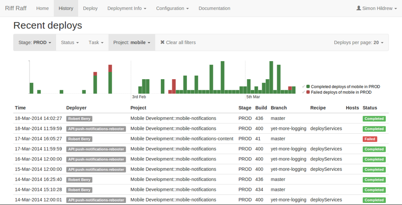
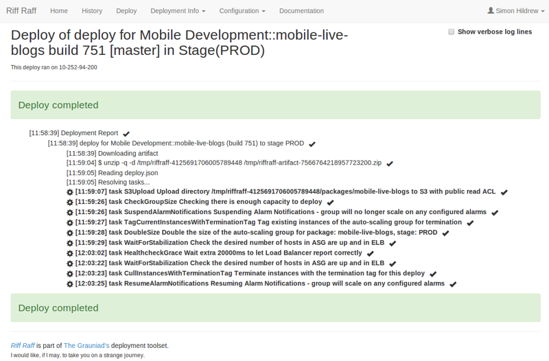
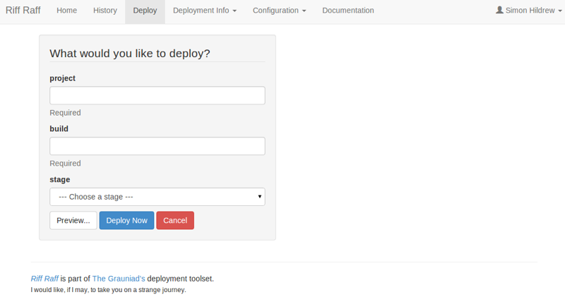
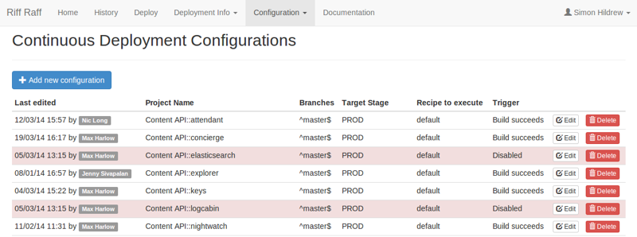
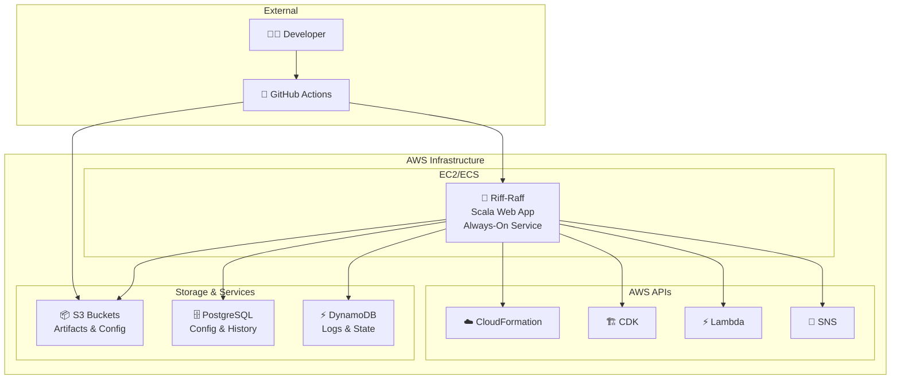
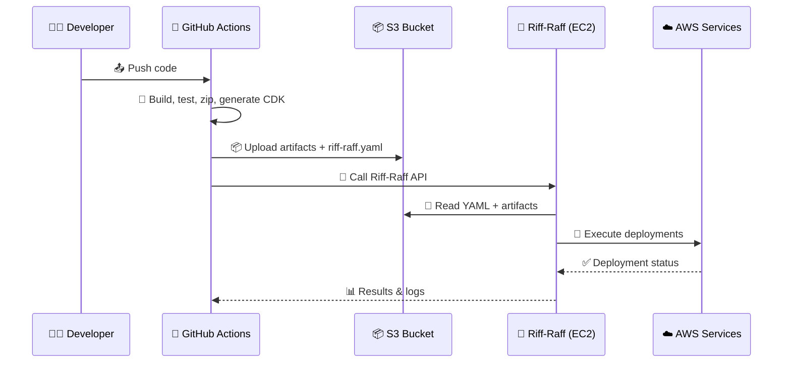

# Riff-Raff
"Deploy the transit beam"

## About
The Guardian's scala-based deployment system is designed to automate deploys by providing a web application that
performs and records deploys, as well as providing various integration points for automating deployment pipelines.

## Requirements
Riff-Raff and Magenta have been built with the tools we use at the Guardian
and you will find it easiest if you use a similar set of tools. Riff-Raff:

- relies on artifacts and `riff-raff.yaml` files describing builds being in S3 buckets with the artifacts having paths of
  the form `project-name/build-number`
- uses the AWS SDK and [Prism](https://github.com/guardian/prism) to do resource discovery
- stores configuration, history and logs in a PostgreSQL database and a handful of DynamoDB tables (the eventual aim is to ditch DynamoDB altogether)

## Documentation
The documentation is available in the application (under the Documentation menu) but can also be viewed under
[riff-raff/public/docs](riff-raff/public/docs) in GitHub.

## In action
Screenshots don't do a lot to show how Riff-Raff works in practice - but here are
a handful anyway, just to give a hint.

***


The deploy history view - this shows all deploys that have ever been done (in this case filtered on PROD and projects containing 'mobile')

***


This is what a single deploy looks like - displaying the overall result and the list of tasks that were executed.

***


The simple form for requesting a deploy can be seen here (further options are available after previewing)

***


Riff-Raff polls our build server frequently and can be configured to automatically start a deploy for newly completed builds

## Contributing
See [CONTRIBUTING.md](./CONTRIBUTING.md).

## What is still left to do?
See the `TODO.txt` file in this project

---

## 🚀 Comprehensive Guide to Riff-Raff

*"Deploy the transit beam"* – The Guardian's full-stack AWS deployment orchestrator.

### 📚 Table of Contents
1. [🏗️ Architecture Overview](#️-architecture-overview)
2. [🧠 Deep Dive: How Riff-Raff Actually Works](#-deep-dive-how-riff-raff-actually-works)
3. [🗺️ Runtime Architecture](#️-runtime-architecture)
4. [🔁 CI/CD Pipeline Flow](#-cicd-pipeline-flow)
5. [📦 Artifact Structure](#-artifact-structure)
6. [⚙️ Deployment Types](#️-deployment-types)
7. [🛠️ Configuration with riff-raff.yaml](#️-configuration-with-riff-raffyaml)
8. [🔗 GitHub Actions Integration](#-github-actions-integration)
9. [✅ Best Practices](#-best-practices)
10. [🧪 Troubleshooting](#-troubleshooting)
11. [🧬 Advanced Features](#-advanced-features)
12. [📚 Additional Resources](#-additional-resources)

---

### 🏗️ Architecture Overview

Riff-Raff is The Guardian's internally developed deployment platform that acts as a deployment orchestrator (not a CI tool). Written in Scala, it controls all production and staging deployments through a centralized interface and API.

#### 💡 What Riff-Raff Is:
- 🎯 A centralized service for managing deployments to AWS
- 🔌 Integrated with GitHub Actions via an API
- 🛡️ A layer of abstraction over infrastructure provisioning (CDK, CloudFormation)
- 🚪 A gatekeeper for deployment safety, logging, permissions, and rollback

#### ❌ What Riff-Raff Is Not:
- 🏗️ A build server (GitHub Actions handles that)
- 🐳 A container orchestrator (no dynamic compute spin-up)
- ⚡ Triggered by AWS services (not S3 → EventBridge)

---

### 🧠 Deep Dive: How Riff-Raff Actually Works

#### ✅ CI/CD Division of Labor

| Stage | Responsibility | Who Does It? |
|-------|---------------|--------------|
| **CI** | Build, test, upload artifacts | 🔧 GitHub Actions |
| **Artifact Push** | Send ZIP, CDK, riff-raff.yaml to S3 | 🔧 GitHub Actions |
| **Trigger Deployment** | Call deployment API | 🔧 GitHub Actions |
| **Read + Deploy** | Read config, run deploys (CDK, Lambda, S3, etc.) | 🚀 Riff-Raff |
| **Execute AWS API Calls** | CloudFormation, CDK, Lambda | 🚀 Riff-Raff (Scala app) |

---

### 🗺️ Runtime Architecture

#### ⚙️ What Runs Riff-Raff?



**Key Points:**
- 🏠 Riff-Raff runs as an always-on Scala application on EC2 (historically in Auto Scaling Groups)
- 🔑 Uses IAM roles for secure AWS API access
- 🔗 Connects directly to AWS APIs using AWS SDKs (Java clients)
- 🚫 No ECS jobs or Lambda as executor - deployments happen within the JVM process

---

### 🔁 CI/CD Pipeline Flow



#### 🔥 Key Insight:
> Riff-Raff is **not** triggered by AWS services (e.g., EventBridge).  
> It is triggered **explicitly** via HTTP API from CI pipelines.

---

### 📦 Artifact Structure

Artifacts are stored in S3 with a specific structure:

```
s3://riff-raff-artifacts/
└── my-project/
    └── 12345/                    # Build number
        ├── riff-raff.yaml        # Deployment configuration
        ├── build.json            # Build metadata
        └── packages/             # Deployment artifacts
            ├── cdk.out/          # CDK synthesized templates
            ├── lambda-code/      # Lambda function code
            └── static-assets/    # Static files for S3
```

**Uploaded by:** `guardian/actions-riff-raff` GitHub Action

---

### ⚙️ Deployment Types

Riff-Raff supports multiple deployment types:

```yaml
deployments:
  cdk:
    type: cdk
  lambda:
    type: aws-lambda
  static:
    type: aws-s3
  cloud:
    type: cloud-formation
```

| Type | Description | Use Case |
|------|-------------|----------|
| **cdk** | 🏗️ CDK-generated templates | Modern infrastructure as code |
| **cloud-formation** | ☁️ Raw JSON/YAML templates | Legacy CloudFormation stacks |
| **aws-lambda** | ⚡ Update Lambda functions | Serverless applications |
| **aws-s3** | 📦 Sync to S3 buckets | Static websites, assets |
| **autoscaling** | 🔄 Update EC2 ASG apps | Traditional server applications |

---

### 🛠️ Configuration with riff-raff.yaml

Example configuration:

```yaml
# Global settings
stacks: [membership]
regions: [eu-west-1]
allowedStages: [CODE, PROD]

# Deployment definitions
deployments:
  lambda:
    type: aws-lambda
    parameters:
      fileName: lambda.zip
      functionNames:
        - my-func-CODE
        - my-func-PROD
      
  frontend:
    type: aws-s3
    parameters:
      bucket: my-app-frontend
      cacheControl: max-age=3600
      
  infrastructure:
    type: cdk
    dependencies: [lambda]  # Deploy after lambda
    parameters:
      templatePath: cdk.out
```

#### 🔧 Key Configuration Options:
- **stacks**: AWS account groupings
- **regions**: Target AWS regions
- **allowedStages**: Environment restrictions
- **dependencies**: Deployment ordering
- **parameters**: Type-specific settings

---

### 🔗 GitHub Actions Integration

Use the official Guardian action to integrate with Riff-Raff:

```yaml
- name: 🚀 Deploy with Riff-Raff
  uses: guardian/actions-riff-raff@v4
  with:
    app: my-app
    roleArn: ${{ secrets.GU_RIFF_RAFF_ROLE_ARN }}
    configPath: ./riff-raff.yaml
    contentDirectories: |
      lambda-code:
        - ./dist/lambda.zip
      cdk:
        - ./cdk.out
      static-assets:
        - ./build/
```

#### 📋 This Action:
1. 📦 Uploads your artifacts to S3
2. 📝 Sends build metadata to Riff-Raff
3. 🎯 Triggers deployment via API
4. 📊 Reports results back to GitHub

---

### ✅ Best Practices

#### 🎯 Deployment Strategy
- ✅ Always trigger deployments explicitly from CI
- ✅ Upload `riff-raff.yaml` with every artifact
- ✅ Use `dependencies:` to control deployment order
- ✅ Test configurations with `dryRun: true`

#### 🔒 Security
- ✅ Use `bucketSsmLookup: true` for secrets management
- ✅ Never hardcode sensitive values in YAML
- ✅ Leverage IAM roles for AWS access
- ✅ Restrict `allowedStages` appropriately

#### 📊 Monitoring
- ✅ Enable verbose logging for troubleshooting
- ✅ Monitor deployment history in Riff-Raff UI
- ✅ Set up SNS notifications for failures
- ✅ Use structured logging in applications

---

### 🧪 Troubleshooting

#### 🔍 Common Issues & Solutions

| Problem | Solution |
|---------|----------|
| **Config validation fails** | Run `riff-raff validate-config` locally |
| **Deployment hangs** | Check IAM permissions and AWS service limits |
| **Artifacts not found** | Verify S3 upload and path structure |
| **CDK deployment fails** | Check CDK synthesis and template validity |

#### 🛠️ Debug Tools
```yaml
# Add to riff-raff.yaml for debugging
deployments:
  my-app:
    type: aws-lambda
    parameters:
      verbose: true      # Enable detailed logging
      dryRun: true      # Test without actual deployment
```

#### 📋 Troubleshooting Checklist
- [ ] Check Riff-Raff UI logs
- [ ] Verify IAM role permissions
- [ ] Confirm artifact upload to S3
- [ ] Validate YAML syntax
- [ ] Test with `dryRun: true`

---

### 🧬 Advanced Features

#### 🔄 Continuous Deployment

```yaml
continuousDeployment:
  enabled: true
  stages: [CODE]
  filters:
    - branch: main
    - buildStatus: success
```

#### ⏰ Scheduled Deployments

```yaml
schedules:
  - name: "Daily deployment to CODE"
    cron: "0 9 * * MON-FRI"
    stage: CODE
    enabled: true
```

#### 🎛️ Advanced Configuration

```yaml
deployments:
  api:
    type: aws-lambda
    parameters:
      # Advanced Lambda settings
      timeout: 30
      memorySize: 512
      environment:
        STAGE: ${stage}
        REGION: ${region}
      
      # VPC configuration
      vpcConfig:
        subnetIds: 
          - subnet-12345
        securityGroupIds:
          - sg-67890
```

---

### 📚 Additional Resources

#### 🔗 Official Links
- [📖 Riff-Raff GitHub Repository](https://github.com/guardian/riff-raff)
- [🏗️ Guardian CDK Guide](https://github.com/guardian/cdk)
- [🔧 Actions Riff-Raff](https://github.com/guardian/actions-riff-raff)
- [☁️ AWS CDK Best Practices](https://docs.aws.amazon.com/cdk/latest/guide/best-practices.html)

#### 📋 Quick Reference
- **API Endpoint**: Internal Guardian service
- **Supported Regions**: `eu-west-1`, `us-east-1`
- **Artifact Retention**: 30 days
- **Max Deployment Time**: 30 minutes

---

## ✅ Final Thoughts

Riff-Raff serves as The Guardian's single point of control for deployments, providing:

- 🎯 **Centralized** deployment management
- 🛡️ **Safe** deployment practices with rollback capabilities
- 👁️ **Observable** deployment history and logging
- 📈 **Scalable** architecture supporting high-frequency deployments

> **No mystery, no magic** — just one clean API to deploy your world 🌍

---

*For questions or contributions, see [CONTRIBUTING.md](./CONTRIBUTING.md) or reach out to the Platform team.*
