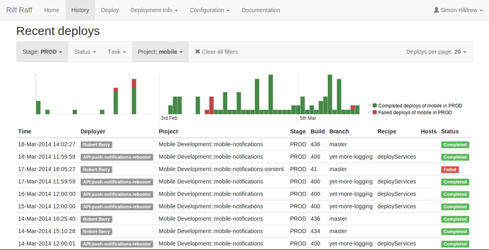
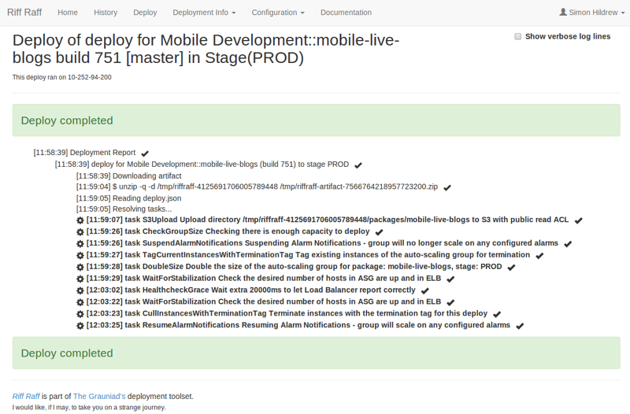
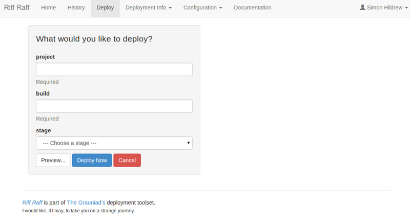
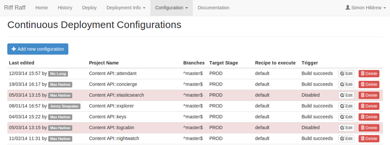

Riff-Raff
=========

"Deploy the transit beam"

About
-----

The Guardian's scala-based deployment system is designed to automate deploys by providing a web application that 
performs and records deploys, as well as providing various integration points for automating deployment pipelines.

Requirements
-----

Riff-Raff and Magenta have been built with the tools we use at the Guardian
and you will find it easiest if you use a similar set of tools. Riff-Raff:

 - relies on artifacts and `riff-raff.yaml` files describing builds being in S3 buckets with the artifacts having paths of 
  the form `project-name/build-number`
 - uses the AWS SDK and [Prism](http://github.com/guardian/prism) to do resource discovery
 - stores configuration, history and logs in a MongoDB instance and a handful of DynamoDB tables (the eventual aim is
   to ditch Mongo altogether)

Documentation
-----

The documentation is available in the application (under the Documentation menu) but can also be viewed under 
[riff-raff/app/docs](riff-raff/app/docs) in github.

In action
-----

Screenshots don't do a lot to show how Riff-Raff works in practice - but here are
a handful anyway, just to give a hint.

***


The deploy history view - this shows all deploys that have ever been done (in this case filtered on PROD and projects containing 'mobile')

***


This is what a single deploy looks like - displaying the overall result and the list of tasks that were executed.

***


The simple form for requesting a deploy can be seen here (further options are available after previewing)

***


Riff-Raff polls our build server frequently and can be configured to automatically start a deploy for newly completed builds

How do I run Riff-Raff locally if I want to hack on it?
-----

### Creating local configuration

1. Create a basic configuration file at `~/.gu/riff-raff.properties`

2. Add the required content - S3 and mongo config are probably the minimum.
You can always speak to one of the Riff Raff maintainers, or a recent contributor, for guidance on the content.

### DynamoDB

#### Running DynamoDB

Riff Raff uses DynamoDB to persist some information. To run Riff Raff 
locally you will need to make sure you have DynamoDB running.

1. Ensure you have DynamoDB as a local jar. [You can download DynamoDB to run as a local jar from the AWS website](http://docs.aws.amazon.com/amazondynamodb/latest/developerguide/Tools.DynamoDBLocal.html).

2. To run DynamoDB for development, navigate to the directory where you extracted the DynamoDBLocal.jar and run the following command:

```
java -Djava.library.path=./DynamoDBLocal_lib -jar DynamoDBLocal.jar -sharedDb -inMemory

```
    
#### Creating the DynamoDB tables

Riff Raff expects certain tables to exist in DynamoDB. The easiest way to 
set these up locally is to run the test that exists for this purpose.

1. In the `AuditTrailDBTest.scala` file, find the line that says `"create
database table"`. You'll notice this string is followed by the `ignore`
operator. 

2. With DynamoDB running locally, change `ignore` to `in` and then run 
these tests.

3. Once the test has run, change that line back to `ignore`.

Since this runs an in-memory version of DynamoDB, you'll need to set
the tables up again each time you restart DynamoDB. 

### Running the application

Assuming you have a reasonably recent version of Java installed, and DynamoDB
is running with the required tables created, you should now be ready to run 
the application!

1. Run the sbt script in the root of the project

2. Enter `project riffraff` at the SBT prompt

3. Enter `run` at the SBT prompt

4. Visit http://localhost:9000/


What is still left to do?
------

See the `TODO.txt` file in this project
