# Riff-Raff
"Deploy the transit beam"

## About
The Guardian's scala-based deployment system is designed to automate deploys by providing a web application that
performs and records deploys, as well as providing various integration points for automating deployment pipelines.

## Requirements
Riff-Raff and Magenta have been built with the tools we use at the Guardian
and you will find it easiest if you use a similar set of tools. Riff-Raff:

- relies on artifacts and `riff-raff.yaml` files describing builds being in S3 buckets with the artifacts having paths of
  the form `project-name/build-number`
- uses the AWS SDK and [Prism](https://github.com/guardian/prism) to do resource discovery
- stores configuration, history and logs in a PostgreSQL database and a handful of DynamoDB tables (the eventual aim is to ditch DynamoDB altogether)

## Documentation
The documentation is available in the application (under the Documentation menu) but can also be viewed under
[riff-raff/public/docs](riff-raff/public/docs) in GitHub.

## In action
Screenshots don't do a lot to show how Riff-Raff works in practice - but here are
a handful anyway, just to give a hint.

***


The deploy history view - this shows all deploys that have ever been done (in this case filtered on PROD and projects containing 'mobile')

***


This is what a single deploy looks like - displaying the overall result and the list of tasks that were executed.

***


The simple form for requesting a deploy can be seen here (further options are available after previewing)

***


Riff-Raff polls our build server frequently and can be configured to automatically start a deploy for newly completed builds

## Contributing
See [CONTRIBUTING.md](./CONTRIBUTING.md).

## What is still left to do?
See the `TODO.txt` file in this project

---

## 🚀 Comprehensive Guide to Riff-Raff

*"Deploy the transit beam"* – The Guardian's full-stack AWS deployment orchestrator.

### 📚 Table of Contents
1. [🏗️ Architecture Overview](#️-architecture-overview)
2. [🧠 Deep Dive: How Riff-Raff Actually Works](#-deep-dive-how-riff-raff-actually-works)
3. [🗺️ Runtime Architecture](#️-runtime-architecture)
4. [🔁 CI/CD Pipeline Flow](#-cicd-pipeline-flow)
5. [📦 Artifact Structure](#-artifact-structure)
6. [⚙️ Deployment Types](#️-deployment-types)
7. [🛠️ Configuration with riff-raff.yaml](#️-configuration-with-riff-raffyaml)
8. [🔗 GitHub Actions Integration](#-github-actions-integration)
9. [✅ Best Practices](#-best-practices)
10. [🧪 Troubleshooting](#-troubleshooting)
11. [🧬 Advanced Features](#-advanced-features)
12. [📚 Additional Resources](#-additional-resources)

---

### 🏗️ Architecture Overview

Riff-Raff is The Guardian's internally developed deployment platform that acts as a deployment orchestrator (not a CI tool). Written in Scala, it controls all production and staging deployments through a centralized interface and API.

#### 💡 What Riff-Raff Is:
- 🎯 A centralized service for managing deployments to AWS, Fastly, and potentially anywhere else if a deployment type is added
- 🔌 Integrated with GitHub Actions via an API
- 🛡️ A layer of abstraction over infrastructure provisioning (CloudFormation and others; CDK is not a deployment type but is built into CloudFormation)
- 🚪 A gatekeeper for deployment safety, logging, permissions, and rollback

#### ❌ What Riff-Raff Is Not:
- 🏗️ A build server (GitHub Actions handles that)
- 🐳 A container orchestrator (no dynamic compute spin-up)
- ⚡ Triggered by S3 bucket events (not by AWS EventBridge or similar)

---

### 🧠 Deep Dive: How Riff-Raff Actually Works

#### ✅ CI/CD Division of Labor

| Stage | Responsibility | Who Does It? |
|-------|---------------|--------------|
| **CI** | Build, test, upload artifacts | 🔧 GitHub Actions |
| **Artifact Push** | Send ZIP, riff-raff.yaml, CloudFormation JSON (built from CDK in CI) to S3 | 🔧 GitHub Actions |
| **Trigger Deployment** | Write to S3 bucket to trigger deployment | 🔧 actions-riff-raff, legacy SBT/node plugins |
| **Read + Deploy** | Riff-Raff polls S3 buckets, reads config, runs deploys (CloudFormation, Lambda, S3, Fastly, etc.) | 🚀 Riff-Raff |
| **Execute API Calls** | AWS, Fastly, etc. | 🚀 Riff-Raff (Scala app) |

---

### 🗺️ Runtime Architecture

#### ⚙️ What Runs Riff-Raff?

```mermaid
graph TB
    subgraph "AWS Infrastructure"
        subgraph "EC2/ECS"
            RR[🚀 Riff-Raff<br/>Scala Web App<br/>Always-On Service]
        end
        
        subgraph "Storage & Services"
            S3[📦 S3 Buckets<br/>Artifacts & Config]
            RDS[🗄️ PostgreSQL<br/>Config & History]
            DDB[⚡ DynamoDB<br/>Logs & State]
        end
        
        subgraph "AWS APIs"
            CF[☁️ CloudFormation]
            LAMBDA[⚡ Lambda]
            SNS[📢 SNS]
        end
    end
    
    subgraph "External"
        GHA[🔧 GitHub Actions]
        DEV[👨‍💻 Developer]
    end
    
    DEV --> GHA
    GHA --> S3
    GHA --> RR
    RR --> S3
    RR --> RDS
    RR --> DDB
    RR --> CF
    RR --> LAMBDA
    RR --> SNS
```



**Key Points:**
- 🏠 Riff-Raff runs as an always-on Scala application on EC2 (historically in Auto Scaling Groups)
- 🔑 Uses IAM roles for secure AWS API access
- 🔗 Connects directly to AWS APIs using AWS SDKs (Java clients)
- 🚫 No ECS jobs or Lambda as executor - deployments happen within the JVM process

#### 🔥 Key Insight:
> Riff-Raff is triggered by S3 bucket events. It polls S3 buckets to decide what to do, based on artifacts written by actions-riff-raff or legacy plugins.

---

### 🔁 CI/CD Pipeline Flow

```mermaid
sequenceDiagram
    participant Dev as 👨‍💻 Developer
    participant GH as 🔧 GitHub Actions
    participant S3 as 📦 S3 Bucket
    participant RR as 🚀 Riff-Raff (EC2)
    participant AWS as ☁️ AWS Services

    Dev->>GH: 📤 Push code
    GH->>GH: 🔨 Build, test, zip, generate CDK
    GH->>S3: 📦 Upload artifacts + riff-raff.yaml
    GH->>RR: 🎯 Call Riff-Raff API
    RR->>S3: 📖 Read YAML + artifacts
    RR->>AWS: 🚀 Execute deployments
    AWS-->>RR: ✅ Deployment status
    RR-->>GH: 📊 Results & logs
```



#### 🔥 Key Insight:
> Riff-Raff is **not** triggered by AWS services (e.g., EventBridge).  
> It is triggered **explicitly** via HTTP API from CI pipelines.

---

### 📦 Artifact Structure

Artifacts are stored in S3 with a specific structure:

```
s3://riff-raff-artifacts/
└── my-project/
    └── 12345/                    # Build number
        ├── riff-raff.yaml        # Deployment configuration
        ├── build.json            # Build metadata
        └── packages/             # Deployment artifacts
            ├── cdk.out/          # CDK synthesized templates (built into CloudFormation JSON in CI)
            ├── lambda-code/      # Lambda function code
            └── static-assets/    # Static files for S3
```

**Uploaded by:** `guardian/actions-riff-raff` GitHub Action

---

### ⚙️ Deployment Types

Riff-Raff supports multiple deployment types. For the full, up-to-date list, see the self-documenting deployment types page: [https://riffraff.gutools.co.uk/docs/magenta-lib/types](https://riffraff.gutools.co.uk/docs/magenta-lib/types)

Example configuration:

```yaml
# Global settings
stacks: [membership]
regions: [eu-west-1]
allowedStages: [CODE, PROD]

# Deployment definitions
deployments:
  lambda:
    type: aws-lambda
  static:
    type: aws-s3
  cloud:
    type: cloud-formation
```

| Type | Description | Use Case |
|------|-------------|----------|
| **aws-lambda** | ⚡ Update Lambda functions | Serverless applications |
| **aws-s3** | 📦 Sync to S3 buckets | Static websites, assets |
| **cloud-formation** | ☁️ Raw JSON/YAML templates | Legacy CloudFormation stacks |
| **autoscaling** | 🔄 Update EC2 ASG apps | Traditional server applications |

---

### 🛠️ Configuration with riff-raff.yaml

Example configuration:

```yaml
# Global settings
stacks: [membership]
regions: [eu-west-1]
allowedStages: [CODE, PROD]

# Deployment definitions
deployments:
  lambda:
    type: aws-lambda
    parameters:
      fileName: lambda.zip
      functionNames:
        - my-func-CODE
        - my-func-PROD
      
  frontend:
    type: aws-s3
    parameters:
      bucket: my-app-frontend
      cacheControl: max-age=3600
      
  infrastructure:
    type: cloud-formation
    dependencies: [lambda]  # Deploy after lambda
    parameters:
      templatePath: cdk.out
```

#### 🔧 Key Configuration Options:
- **stacks**: AWS account groupings
- **regions**: Target AWS regions
- **allowedStages**: Environment restrictions
- **dependencies**: Deployment ordering
- **parameters**: Type-specific settings

---

### 🔗 GitHub Actions Integration

Use the official Guardian action to integrate with Riff-Raff:

```yaml
- name: 🚀 Deploy with Riff-Raff
  uses: guardian/actions-riff-raff@v4
  with:
    app: my-app
    roleArn: ${{ secrets.GU_RIFF_RAFF_ROLE_ARN }}
    configPath: ./riff-raff.yaml
    contentDirectories: |
      lambda-code:
        - ./dist/lambda.zip
      cdk:
        - ./cdk.out
      static-assets:
        - ./build/
```

#### 📋 This Action:
1. 📦 Uploads your artifacts to S3
2. 📝 Sends build metadata to Riff-Raff
3. 🎯 Triggers deployment via API
4. 📊 Reports results back to GitHub

---

### ✅ Best Practices

#### 🎯 Deployment Strategy
- ✅ Always trigger deployments explicitly from CI
- ✅ Upload `riff-raff.yaml` with every artifact
- ✅ Use `dependencies:` to control deployment order
- ✅ Test configurations with `dryRun: true`

#### 🔒 Security
- ✅ Use `bucketSsmLookup: true` for secrets management
- ✅ Never hardcode sensitive values in YAML
- ✅ Leverage IAM roles for AWS access
- ✅ Restrict `allowedStages` appropriately

#### 📊 Monitoring
- ✅ Enable verbose logging for troubleshooting
- ✅ Monitor deployment history in Riff-Raff UI
- ✅ Set up SNS notifications for failures
- ✅ Use structured logging in applications

---

### 🧪 Troubleshooting

#### 🔍 Common Issues & Solutions

| Problem | Solution |
|---------|----------|
| **Config validation fails** | Run `riff-raff validate-config` locally |
| **Deployment hangs** | Check IAM permissions and AWS service limits |
| **Artifacts not found** | Verify S3 upload and path structure |
| **CDK deployment fails** | Check CDK synthesis and template validity |

#### 🛠️ Debug Tools
```yaml
# Add to riff-raff.yaml for debugging
deployments:
  my-app:
    type: aws-lambda
    parameters:
      verbose: true      # Enable detailed logging
      dryRun: true      # Test without actual deployment
```

#### 📋 Troubleshooting Checklist
- [ ] Check Riff-Raff UI logs
- [ ] Verify IAM role permissions
- [ ] Confirm artifact upload to S3
- [ ] Validate YAML syntax
- [ ] Test with `dryRun: true`

---

### 🧬 Advanced Features

#### 🔄 Continuous Deployment

```yaml
continuousDeployment:
  enabled: true
  stages: [CODE]
  filters:
    - branch: main
    - buildStatus: success
```

#### ⏰ Scheduled Deployments

```yaml
schedules:
  - name: "Daily deployment to CODE"
    cron: "0 9 * * MON-FRI"
    stage: CODE
    enabled: true
```

#### 🎛️ Advanced Configuration

```yaml
deployments:
  api:
    type: aws-lambda
    parameters:
      # Advanced Lambda settings
      timeout: 30
      memorySize: 512
      environment:
        STAGE: ${stage}
        REGION: ${region}
      
      # VPC configuration
      vpcConfig:
        subnetIds: 
          - subnet-12345
        securityGroupIds:
          - sg-67890
```

---

### 📚 Additional Resources

#### 🔗 Official Links
- [📖 Riff-Raff GitHub Repository](https://github.com/guardian/riff-raff)
- [🏗️ Guardian CDK Guide](https://github.com/guardian/cdk)
- [🔧 Actions Riff-Raff](https://github.com/guardian/actions-riff-raff)
- [☁️ AWS CDK Best Practices](https://docs.aws.amazon.com/cdk/latest/guide/best-practices.html)

#### 📋 Quick Reference
- **API Endpoint**: Internal Guardian service
- **Supported Regions**: `eu-west-1`, `us-east-1`
- **Artifact Retention**: 30 days
- **Max Deployment Time**: 30 minutes

---

## Official Documentation & Useful Links

- [riff-raff.yaml reference](https://riffraff.gutools.co.uk/docs/reference/riff-raff.yaml.md)
- [Magenta-lib types reference (CloudFormation, etc.)](https://riffraff.gutools.co.uk/docs/magenta-lib/types#cloudformation)
- [Validate your riff-raff.yaml (syntax, config)](https://riffraff.gutools.co.uk/configuration/validation)
- [Riff Raff Dashboard](https://riffraff.gutools.co.uk/)

---

## Riff Raff Dashboard Overview

Riff Raff provides a comprehensive web dashboard for managing deployments, viewing history, accessing configuration and documentation, and more. The dashboard is available at:

**[https://riffraff.gutools.co.uk/](https://riffraff.gutools.co.uk/)**

### Main Features (see screenshots below)
- **Deploy tab:** Start a deployment, select your project, build, and stage. Mark projects as favourites for quick access.
- **History tab:** View recent deployments, their status, deployer, time, branch, and more. Quickly spot failed or warning deployments.
- **Deployment Resources:** Access resources related to deployments.
- **Configuration menu:** Manage Continuous Deployment, Hooks, Authorisation, API keys, Restrictions, and Schedules.
- **Documentation menu:** Access built-in guides on deployment types, configuration validation, troubleshooting failed deploys, and more.

### Screenshots

#### Deploy Screen


#### Configuration Menu


#### Documentation Menu


#### History Screen


---

## riff-raff.yaml Configuration Reference

### Purpose
The `riff-raff.yaml` file is the heart of your deployment configuration for Riff Raff. It defines what, how, and where to deploy. **Always use the Validate Template feature in Riff Raff to get fast feedback and avoid deployment errors.**

---

### Main Top-Level Keys

| Key            | Description                                                                                               |
|----------------|-----------------------------------------------------------------------------------------------------------|
| `stacks`       | Default stack names (e.g. AWS accounts) for resources in this deploy. Can be overridden per deployment.   |
| `regions`      | Default AWS regions for deployment. Can be overridden per deployment.                                     |
| `allowedStages`| (Optional) List of permitted deployment stages (e.g. CODE, PROD).                                         |
| `templates`    | Map of reusable deployment templates. Can be inherited and overridden by deployments.                     |
| `deployments`  | Map of actual deployment steps. Each key is a deployment name, each value is a DeploymentOrTemplate.      |

---

### DeploymentOrTemplate Object Fields

| Field             | Description                                                                                   |
|-------------------|-----------------------------------------------------------------------------------------------|
| `type`            | The deployment type (e.g. `autoscaling`, `aws-lambda`, etc.). Required unless using `template` |
| `template`        | Name of a template to inherit from. Required unless using `type`                              |
| `stacks`          | List of stacks for this deployment. Overrides global stacks.                                  |
| `regions`         | List of AWS regions for this deployment. Overrides global regions.                            |
| `actions`         | (Optional) List of actions to execute for this deployment type.                               |
| `app`             | (Optional) App name for resource lookups. Defaults to deployment name.                        |
| `contentDirectory`| (Optional) Directory for deployment assets. Defaults to deployment name.                       |
| `dependencies`    | (Optional) List of deployments that must complete first.                                      |
| `parameters`      | (Optional) Map of parameters for the deployment type.                                         |

---

### Minimal Example
```yaml
regions:
  - eu-west-1
stacks:
  - deploy
deployments:
  prism:
    type: autoscaling
    parameters:
      bucket: deploy-tools-dist
```

### Advanced Example with Templates and Overrides
```yaml
regions: [eu-west-1]
stacks: [flexible, flexible-secondary]

templates:
  flexible:
    type: autoscaling
    parameters:
      bucket: composer-dist

deployments:
  api:
    template: flexible
  composer-backend:
    template: flexible
  integration:
    template: flexible
    stacks: [flexible]
```

---

### Deployment Types Overview

| Type                   | Description                                                                 |
|------------------------|-----------------------------------------------------------------------------|
| `autoscaling`          | Deploy to an AWS autoscaling group (EC2).                                   |
| `aws-lambda`           | Deploy and update AWS Lambda functions.                                     |
| `aws-lambda-layer`     | Deploy and update Lambda layers.                                            |
| `aws-s3`               | Upload files to an S3 bucket.                                               |
| `cloud-formation`      | Update AWS CloudFormation stacks.                                           |
| `fastly`               | Deploy VCL configs to Fastly CDN.                                           |
| `fastly-compute`       | Deploy Compute@Edge packages to Fastly.                                     |
| `gcp-gcs`              | Upload files to a GCP bucket.                                               |
| `self-deploy`          | Special type for self-deploying Riff Raff itself.                           |

---

### Key Deployment Types: Actions & Parameters

#### autoscaling
- **Actions:** `uploadArtifacts`, `deploy`
- **Key Parameters:**
  - `bucket`: S3 bucket for artifacts
  - `asgMigrationInProgress`: Deploy to two ASGs if true
  - `healthcheckGrace`, `secondsToWait`, etc.: Various timing and prefix options

#### aws-lambda
- **Actions:** `uploadLambda`, `updateLambda`
- **Key Parameters:**
  - `bucket`: S3 bucket for Lambda code
  - `functionNames` or `functions`: Lambda names and file mappings
  - `fileName`: Archive name (default: `<packageName>.zip`)

#### cloud-formation
- **Actions:** `updateStack`
- **Key Parameters:**
  - `amiParametersToTags`, `amiTags`: AMI lookup
  - `cloudFormationStackName`: Stack to update
  - `templateParameters`, `templatePath`: Template and parameters
  - `manageStackPolicy`: Manage stack update policies

#### aws-s3
- **Actions:** `uploadStaticFiles`
- **Key Parameters:**
  - `bucket`: S3 bucket for static files
  - `cacheControl`, `publicReadAcl`, `mimeTypes`: Control headers and access
  - `prefixApp`, `prefixStack`, `prefixStage`: Path structure

---

### Best Practices for riff-raff.yaml
- **Always validate your riff-raff.yaml** before deploying ([validation tool](https://riffraff.gutools.co.uk/configuration/validation)).
- Use templates to avoid repetition and keep configs DRY.
- Use `allowedStages` to restrict where deployments can go.
- Explicitly list dependencies to ensure correct deployment order.
- Use descriptive deployment names and comments.
- Prefer SSM keys and parameters for sensitive or environment-specific values.

---

**Remember:**
- The [Validate Template](https://riffraff.gutools.co.uk/configuration/validation) page gives fast feedback on your config.
- For more details and advanced options, see the [riff-raff.yaml reference](https://riffraff.gutools.co.uk/docs/reference/riff-raff.yaml.md).

---

## ⚠️ IMPORTANT: Manual Deployments for Membership CODE Environments

<div style="color: red; border: 2px solid red; padding: 12px; font-weight: bold; background: #fff0f0">
<strong>For <code>membership</code> projects in the <code>CODE</code> environment, deployments are <u>NOT</u> triggered automatically!</strong><br>
You must trigger these deployments manually from the Riff Raff dashboard.
This is a critical step – please ensure you always deploy CODE manually when working on membership services.
</div>

---

## Validating Your riff-raff.yaml Before Deployment

Before deploying, you can validate your `riff-raff.yaml` configuration file to check for syntax errors and configuration issues. This helps prevent failed deploys and ensures your config complies with Riff Raff requirements.

- **Validate here:** [https://riffraff.gutools.co.uk/configuration/validation](https://riffraff.gutools.co.uk/configuration/validation)

---

## Best Practices & Tips
- **Always validate your config before deploying.**
- Use the dashboard documentation menu for up-to-date guides and troubleshooting.
- Mark your most-used projects as favourites for faster access.
- Check the deployment history for warnings, failures, or unusual activity.
- For any environment with manual deploys (like `membership:CODE`), communicate with your team and document the deployment in the release notes.

---

## Additional Resources
- [riff-raff.yaml full reference](https://riffraff.gutools.co.uk/docs/reference/riff-raff.yaml.md)
- [Magenta-lib/types (CloudFormation, etc.)](https://riffraff.gutools.co.uk/docs/magenta-lib/types#cloudformation)
- [Dashboard](https://riffraff.gutools.co.uk/)

---

For more details, see the in-app documentation or reach out to the DevX/Platform team.
